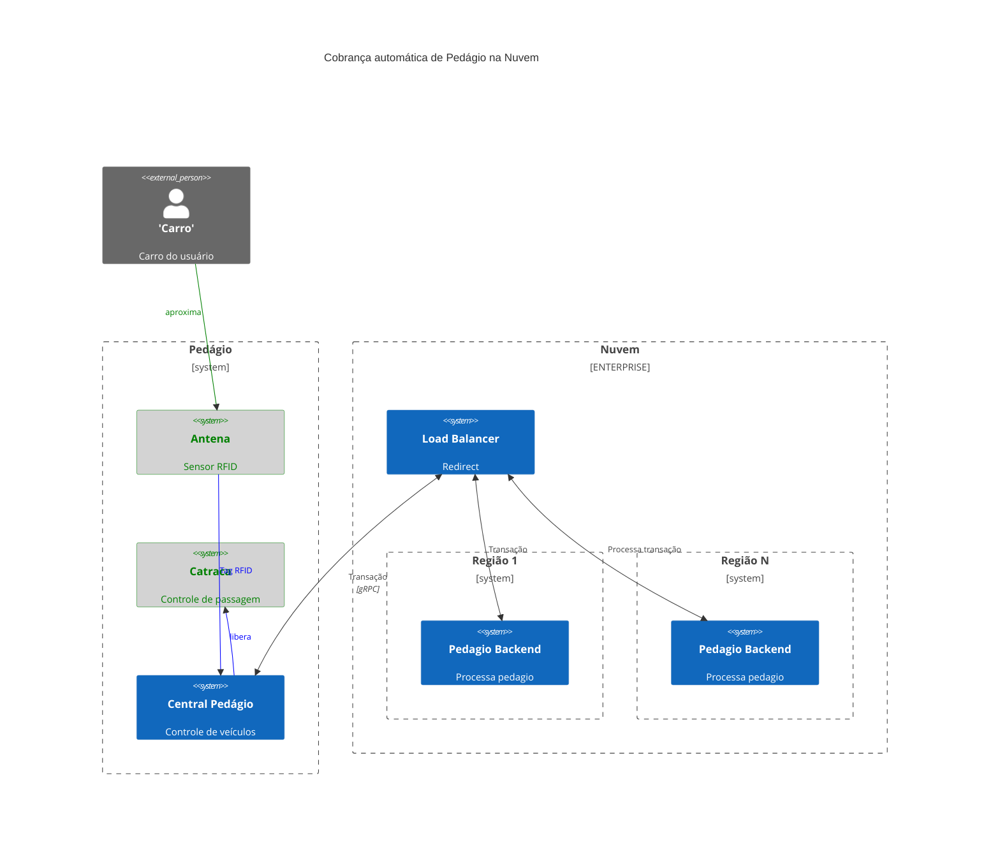

# bla

Arquitetura

@content(./pedagio.puml)

```mermaid

C4Context

  title Cobrança automática de Pedágio na Nuvem

  Person_Ext(car, 'Carro', "Carro do usuário")

  Boundary(b0, "Pedágio") {
      System(rfid, "Antena", "Sensor RFID")
      System(catraca, "Catraca", "Controle de passagem")
      Rel(car, rfid, "aproxima")

      System(central, "Central Pedágio", "Controle de veículos")
      Rel(rfid, central, "Tag RFID")

      Rel(central, catraca, "libera")
  }
  UpdateRelStyle(car, rfid, $textColor="green", $lineColor="green", $offsetY="-40", $offsetX="-60")
  UpdateElementStyle(catraca, $fontColor="green", $bgColor="lightgrey", $borderColor="green")
  UpdateElementStyle(rfid, $fontColor="green", $bgColor="lightgrey", $borderColor="green")

  UpdateRelStyle(rfid, central, $textColor="blue", $lineColor="blue", $offsetY="-10", $offsetX="0")
  UpdateRelStyle(central, catraca, $textColor="blue", $lineColor="blue", $offsetY="-10", $offsetX="0")

  Enterprise_Boundary(nuvem, "Nuvem") {

    System(lb,"Load Balancer","Redirect")

    Boundary(region1, "Região 1") {
      System(pedagio1, "Pedagio Backend","Processa pedagio")

      BiRel(lb, pedagio1, "Transação")
    }

    BiRel(central, lb, "Transação","gRPC")

    Boundary(regionN, "Região N") {
      System(pedagioN, "Pedagio Backend","Processa pedagio")

      BiRel(lb, pedagioN, "Processa transação")
    }

  }


  UpdateLayoutConfig($c4ShapeInRow="2", $c4BoundaryInRow="2")
```